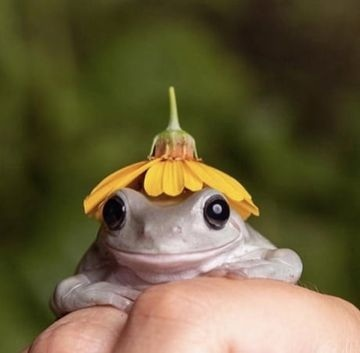

::: columns
::: {.column width="50%" style="text-align: center;"}

```{r, echo=FALSE, fig.align='center', out.width='80%'}

```

## Najiyah Williamson

:::

::: {.column width="50%" style="text-align: left;"}

Najiyah is a second-year MPH student in Environmental Health and Epidemiology at Rollins School of Public Health, Emory University. She currently works as a wastewater implementation data analyst for Dr. Marlene Wolfe's lab in conjunction with WastewaterSCAN. Her previous work spans research on aquatic organisms, disease ecology, climate health, and pesticides. Her most recent notable achievement is winning the Award for Excellence in Environmental Health Research at Rollins School of Public Health. 

:::

